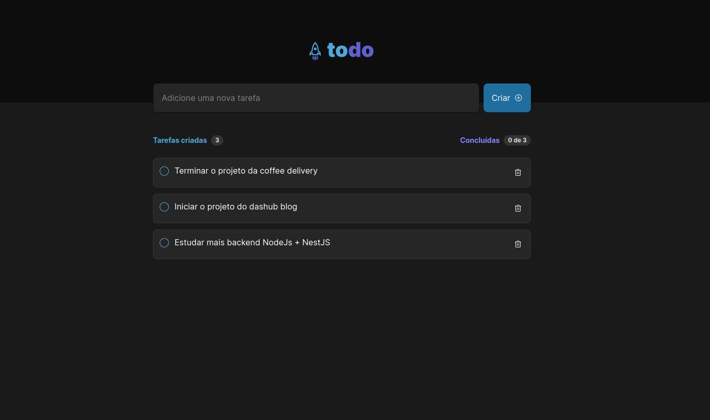

 

## 📄 Descrição

Projeto desenvolvido com intuito de criar uma aplicação de criação de lista de tarefas, feito com ReactJS, ViteJs, Localstorage (armazenar a lista de tarefas), TailwindCSS e SASS

## 🛠 Technologies

![react][react] ![vite][vite] ![tailwind css][tailwind] ![sass][sass]

## 📷 Screenshots

## 🦾 Sobre mim

[react]: https://img.shields.io/badge/react%20js-1E4174?style=for-the-badge&logo=react&logoColor=white&labelColor=81D8F7

[vite]: https://img.shields.io/badge/vite%20js-1E4174?style=for-the-badge&logo=vite&logoColor=white&labelColor=FFD028

[sass]: https://img.shields.io/badge/sass-1E4174?style=for-the-badge&logo=sass&logoColor=white&labelColor=ff99c8

[tailwind]: https://img.shields.io/badge/tailwind%20css-1E4174?style=for-the-badge&logo=tailwindcss&logoColor=white&labelColor=0EA5E9
